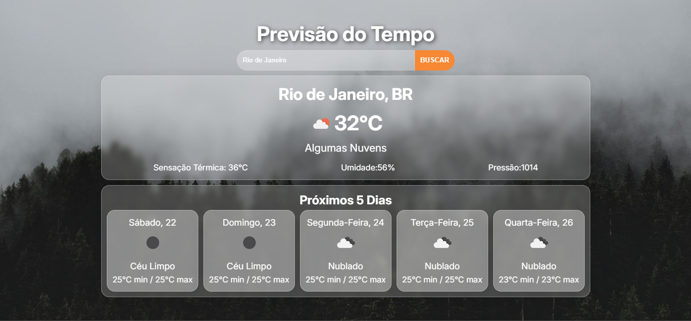

# Previsão do Tempo 🌤️⚡

Este é um aplicativo de previsão do tempo desenvolvido com **TypeScript** e **React**. Ele integra a **API do OpenWeather** para buscar informações climáticas atualizadas e exibir previsões detalhadas para diferentes localidades.

## 📱 Funcionalidades

- Exibe o clima atual de uma cidade.
- Mostra a previsão do tempo para os próximos dias.
- Exibe dados como temperatura, umidade, pressão do vento e descrição do clima.
- Permite que o usuário busque por diferentes cidades.

## 🚀 Tecnologias Utilizadas

- **TypeScript**: Para garantir um código mais seguro e com tipagem forte.
- **React**: Biblioteca JavaScript para a criação de interfaces de usuário dinâmicas.
- **Vite**: Ferramenta de build rápida para desenvolvimento.
- **API do OpenWeather**: Para buscar dados climáticos atualizados.

## 📸 Imagens

### 1. Tela Inicial do App

### 2. Exemplo de Previsão do Tempo

